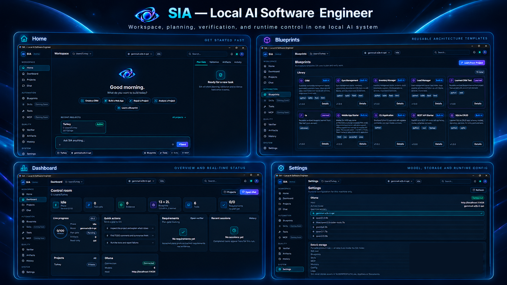

# SIA — Structured Intelligence Agent

> **A TYKAIRO AI product** — Founded by **Mahmoud Hisham**

**Local-first reliability layer for small language models — structured planning, tool intelligence, verification, bounded recovery, and evidence-based completion.**

[](#project-status)
[](#design-principles)
[](#repository-scope)
[](https://github.com/TYKAIRO-AI)

## Desktop Interface Preview



*Visual overview of the SIA desktop interface. Interface features remain under active development.*

**SIA (Structured Intelligence Agent)** is an experimental AI agent runtime focused on making smaller local models more dependable at real software-development work. Instead of relying only on a larger model, SIA moves more reliability into the runtime: planning, tool selection, validation, verification, recovery, and evidence-based completion.

## Model & Hardware Target

SIA is currently focused primarily on **3B–8B local models**, with most development and testing currently being done with **Qwen2.5 Coder Tools 7B**.

| Model size | Current SIA focus | Notes |
|---|---|---|
| **1B–3B** | Experimental | Needs more testing |
| **3B–8B** | **Primary target** | Main development and testing range |
| **10B–14B** | Planned testing | Hardware dependent |
| **30B+** | Not the main goal | SIA is intended to reduce dependence on much larger local models |

SIA does **not** claim to make a 7B model equivalent to a 30B+ model. The goal is to measure how much structured planning, tool use, validation, bounded repair/retries, and state management can improve the reliability of smaller models.

Rather than publishing guessed hardware requirements, SIA will document measured results as testing expands, including **RAM/VRAM usage, execution time, model/tool calls, repair attempts, task success rate, and raw-model-vs-SIA comparisons**.

> **Public showcase repository**  
> This repository intentionally contains architecture notes, design documents, benchmark methodology, and safe examples only. The proprietary SIA implementation is not published here.

## Why SIA?

Small local models can often understand a coding task, but reliability drops when they must:

- plan multi-step work
- select and call tools correctly
- modify multiple project files
- recover from invalid tool arguments
- verify that changes really worked
- avoid declaring success too early

SIA explores a runtime-first approach to those problems.

## Core Architecture

```text
User Goal
   ↓
Requirements
   ↓
Deterministic Planning
   ↓
Tool Resolution → Schema Validation → Permission Gate
   ↓
Execution
   ↓
Result Validation
   ↓
Project-Wide Verification
   ↓
Self Review → Bounded Repair
   ↓
Evidence-Based Completion
```

## Project Status

SIA is currently in the **reliability hardening and tool-intelligence phase**.

Current public-safe status:

- deterministic planning and requirement/artifact tracking are implemented
- project-wide verification, self-review, bounded repair, stale-evidence invalidation, and completion gates are implemented and being hardened
- reliable tool intelligence is the active engineering focus
- the public benchmark harness v0 is available, while controlled comparative SIA-vs-baseline results are still pending
- reliability telemetry is being brought forward so tool/model calls, repairs, verification failures, execution time, and resource usage can be measured early
- persistent agent state is planned for goals, plans, artifacts, evidence, tool state, and progress independent of the UI
- MCP interoperability remains a major next layer, including an OpenAPI-to-tool/MCP import path
- controlled worker-agent / multi-agent orchestration is under architecture exploration, behind SIA's verification and reliability gates

> Private development regression suites have reached large passing-test milestones across development iterations. These internal counts are engineering evidence, not public benchmark scores.

## Current Focus

### Planning & execution control
- deterministic planning before project changes
- explicit requirement tracking
- artifact-aware task execution
- duplicate/no-progress protection

### Verification & recovery
- project-wide verification
- self-review before completion
- bounded repair loops
- stale-evidence invalidation
- completion gates to reduce false success

### Tool intelligence
- unified native/MCP/custom tool registry
- capability-aware intent-to-tool routing
- input schema validation
- deterministic repair of simple argument errors
- permission and risk controls
- tool-result verification
- recovery taxonomy and reliability telemetry

## Design Principles

- **Local-first** — designed for local models and ordinary developer hardware
- **Model-agnostic runtime** — keep orchestration outside the model where possible
- **Deterministic where practical** — do not ask the LLM to solve problems normal code can solve reliably
- **Evidence over confidence** — task completion should be supported by verification
- **Bounded recovery** — retries and repairs must have clear limits
- **Simple user experience** — complexity belongs inside the runtime, not in the prompt

## Roadmap

| Area | Status |
|---|---|
| Deterministic planning | Implemented |
| Artifact / requirement tracking | Implemented |
| Project-wide verification | Implemented |
| Self-review and bounded repair | Implemented |
| Reliable tool intelligence | **In progress** |
| Reliability telemetry | **Starting in current stage** |
| MCP interoperability | Planned |
| OpenAPI → Tool/MCP import | Planned |
| Context intelligence | Planned |
| Persistent agent state | Planned |
| Reusable skills/workflows | Planned |
| Controlled worker agents | Architecture exploration |
| Benchmark harness | **Public v0 available; controlled comparison pending** |

See [docs/ARCHITECTURE.md](docs/ARCHITECTURE.md) and [docs/ROADMAP.md](docs/ROADMAP.md).

## Benchmark Philosophy

SIA should be measured against the **same local model on the same hardware and task set**, comparing:

1. the raw model / basic agent loop
2. the same model running through SIA

Useful metrics include task success, tool-call success, invalid arguments, repair count, verification failures, false completion, runtime, and resource usage.

A public-safe benchmark harness is available in benchmarks/v0. **No comparative performance numbers are published yet**; results should only be added after controlled runs under the same model, hardware, task set, and evaluation conditions.

## Progress Reports

- [Report #001 — English](reports/001-ai-native-development-report.en.md)
- [Report #001 — العربية](reports/001-ai-native-development-report.ar.md)
- [Report #002 — English](reports/002-weekly-progress-2026-10-10.en.md)

## Repository Scope

Included:
- architecture documentation
- reliability design notes
- safe illustrative examples
- roadmap and benchmarking methodology
- public-safe benchmark cases, result format, and scorer

Not included:
- proprietary runtime implementation
- private prompts or internal policies
- production orchestration code
- private test corpus

## Follow the project

If SIA's reliability-first approach is useful to you, star the repository and watch releases to follow public benchmark work, architecture updates, and future interoperability milestones.

Ideas and discussion around reliable local-agent runtimes are welcome through GitHub Issues.

## Project Ownership

**Project Owner & Creator:** Mahmoud Hisham  
**Organization:** [TYKAIRO AI](https://github.com/TYKAIRO-AI)  
**Role:** Founder, product direction, development direction, testing, verification, and final approval of SIA — Structured Intelligence Agent  
**GitHub:** [@Turkeyz1](https://github.com/Turkeyz1)

---

Copyright © 2026 Mahmoud Hisham. All rights reserved.  
No license is granted for the proprietary SIA implementation.
